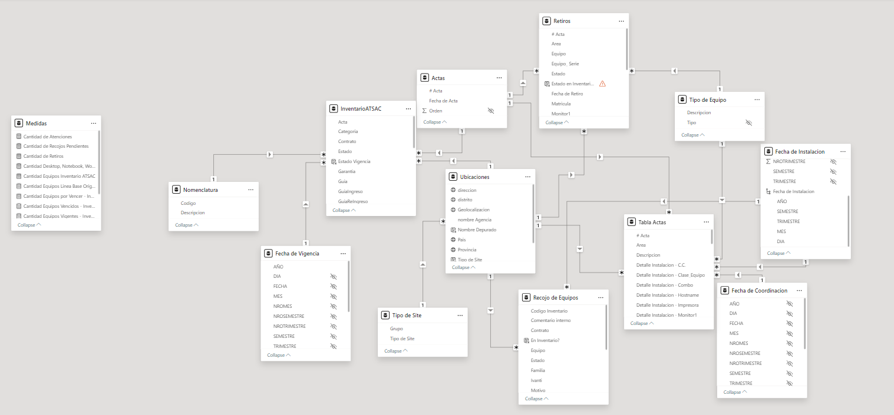

# TechRefresh-Dashboard
Dashboard about technological renew

## Description
This panel represents the updated information for taking action based on the equipment whose validity has expired. This helps to make an optimal distribution of personnel as well as the optimization of logistical management for the deployment of equipment.

## Table of Contents
1. [Background](#background)
2. [Tools & Technologies](#tools--technologies)
3. [Preview](#preview)
4. [Features](#features)
5. [Slides Overview](#slides-overview)
   - [Sheet 1: Executive Summary](#sheet-1-executive-summary)
   - [Sheet 2: Sales Analysis](#sheet-2-sales-analysis)
   - [Sheet 3: Customer Analysis](#sheet-3-customer-analysis)
   - [Sheet 4: Product Analysis](#sheet-4-product-analysis)
6. [Contacts and Support](#contacts-and-support)

## Background
The creation of this dashboard was driven by the client's demand for advanced data analysis and visualization capabilities. This tool enables the client to visually monitor the progress of technological equipment renewals, providing clear insights into the number of devices that have been renewed and those still pending. The objective was to deliver an interactive, user-friendly dashboard that enhances operational efficiency.

## Tools & Technologies
The following technologies were used to develop this dashboard:
- **Sharepoint**: Where the reports (.xls) with the necessary information are stored.
- **Power Query**: For data transformation.
- **DAX**: For calculate measures.
- **Power BI**: To show the dashboard.

## Preview

## Features
- Interactive visualizations: line charts, bar charts, pie charts, map chart and more.
- Dynamic filters: filter data by date, category equipment, and other dimensions.
- Customizable panels: Tooltip displaying details of expired and current teams, categorized by location.
- Data export: export visualizations and data in CSV formats.

## Slides Overview
### Slide 2: Dashboard Principal - ACTA
The "Dashboard Principal - ACTA" sheet provides an overview of the most important data, including:
- **Atenciones por día (Quantity atentions per day)**: Displays the daily number of renewals and additions for different technological devices.
- **Tipo de Equipo Instalado (Installed equipment per type)**: Bar charts summarizing installed equipments.

### Slide 3: Recojo de Equipos (Equipment Pickup)
Shows the total number of equipment collected and the location where it came from.

### Slide 4: Inventario de Almacen
Warehouse Inventory

### Slide 5: Vigencia de equipos almacen
It shows the current status of the different equipment that is still in our warehouse.

### Slide 6: Ubicacion Vigencia de Equipos
Shows for each location how many IT devices are current and how many have expired contracts. This visualization makes use of "tooltips"

## Contacts and Support
For any questions or support, contact [Marco Chang](mailto:marcochangbegazo@gmail.com).
