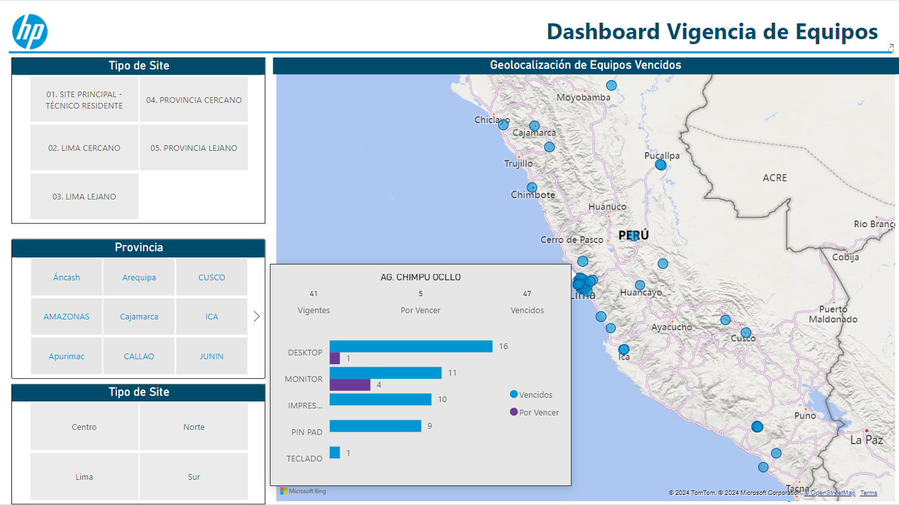

# TechRefresh-Dashboard
Dashboard about technological renew

)

## Description
This project is an interactive dashboard designed for data analysts. It allows you to visualize, explore, and analyze large volumes of data through an intuitive and feature-rich interface.

## Table of Contents
1. [Background](#background)
2. [Technologies Used](#technologies-used)
3. [Preview](#preview)
4. [Features](#features)
5. [Sample Data](#sample-data)
6. [Usage](#usage)
   - [Sheet 1: Executive Summary](#sheet-1-executive-summary)
   - [Sheet 2: Sales Analysis](#sheet-2-sales-analysis)
   - [Sheet 3: Customer Analysis](#sheet-3-customer-analysis)
   - [Sheet 4: Product Analysis](#sheet-4-product-analysis)
7. [Contacts and Support](#contacts-and-support)

## Background
The creation of this dashboard was driven by the client's demand for advanced data analysis and visualization capabilities. This tool enables the client to visually monitor the progress of technological equipment renewals, providing clear insights into the number of devices that have been renewed and those still pending. The objective was to deliver an interactive, user-friendly dashboard that enhances operational efficiency.

## Technologies Used
The following technologies were used to develop this dashboard:
- **SQL**: For data querying and manipulation.
- **Power Query**: For data transformation and connection.
- **Power Automate**: For automating workflows and data integration.
- **[Add other technologies as needed]**

## Preview

## Features
- Interactive visualizations: line charts, bar charts, pie charts, and more.
- Dynamic filters: filter data by date, category, and other dimensions.
- Customizable panels: adjust layout and content according to your needs.
- Data export: export visualizations and data in multiple formats.

## Sample Data
The dashboard uses sample data from the `example_dataset.csv` file. This dataset includes information on sales, customers, and products.

## Usage
### Sheet 1: Executive Summary
The Executive Summary sheet provides an overview of the most important data, including:
- **Key Performance Indicators (KPIs)**: Displays the most relevant KPIs such as total sales, number of customers, etc.
- **Summary Charts**: Bar and line charts summarizing overall trends.

### Sheet 2: Sales Analysis
This sheet allows you to analyze sales in detail:
- **Date Filters**: Select specific date ranges to filter the data.
- **Monthly Sales Chart**: Visualizes sales month by month.
- **Sales Distribution by Region**: Heatmap showing sales by region.

### Sheet 3: Customer Analysis
This sheet focuses on customer data:
- **Customer Segmentation**: Pie chart showing customer segmentation by categories such as age or income.
- **Purchase History**: Detailed table with customer purchase history.

### Sheet 4: Product Analysis
This sheet lets you see product performance:
- **Sales by Product Category**: Bar chart showing sales by category.
- **Top Selling Products**: Table with the top-selling products and their key metrics.

## Contacts and Support
For any questions or support, contact [Marco Chang](mailto:marcochangbegazo@gmail.com).
